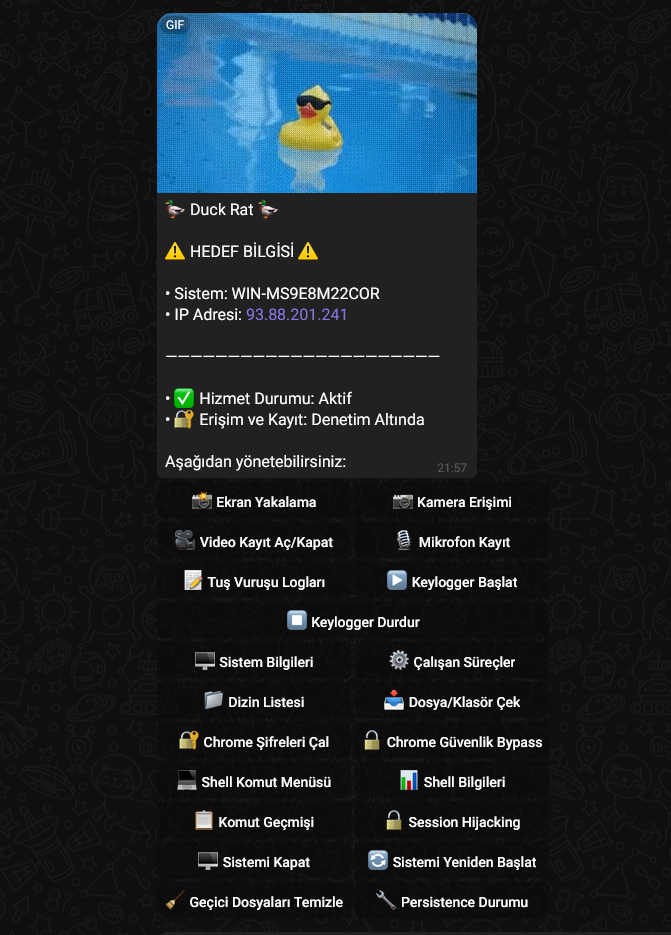

# 🦆 Duck Rat

<div align="center">
  
  
  [](https://python.org)
  [](https://telegram.org)
</div>

## 🚀 Kurulum

```bash
pip install -r requirements.txt
```

## ⚙️ Kullanım

1. `telegram_rat.py` dosyasında token-chatid ayarlayınız
2. `python telegram_rat.py` ile başlatın

## 🎯 Özellikler

- 📸 Ekran görüntüsü ve kamera
- ⌨️ Keylogger
- 🖥️ Sistem yönetimi
- 🔐 Chrome şifreleri
- 💻 Shell komutları
- 🔄 Otomatik başlatma

## ⚠️ Uyarı

Bu araç sadece kendi bilgisayarınızda kullanılmalıdır.
