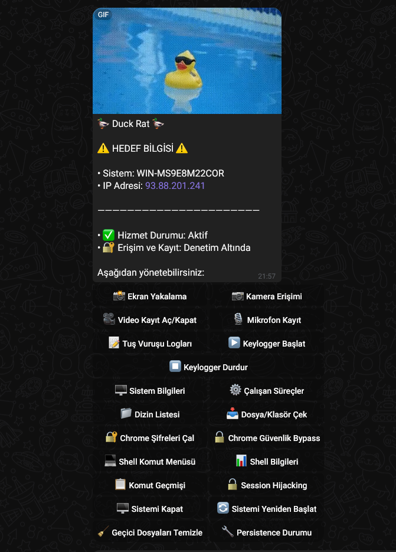

# 🦆DuckRat

<div align="center">
  
  
  [](https://python.org)
  [](https://telegram.org)
</div>

## 🚀 Installation

```bash
pip install -r requirements.txt
```

## ⚙️ Usage

1. Set token-chatid in `telegram_rat.py` file
2. `python telegram_rat.py` Launch with

## 🎯 Features

- 📸 Screenshot and camera
- ⌨️ Keylogger
- 🖥️ System management
- 🔐 Chrome passwords
- 💻 Shell commands
- 🔄 Autostart

## ⚠️ Warning

This tool should only be used on your own computer.
